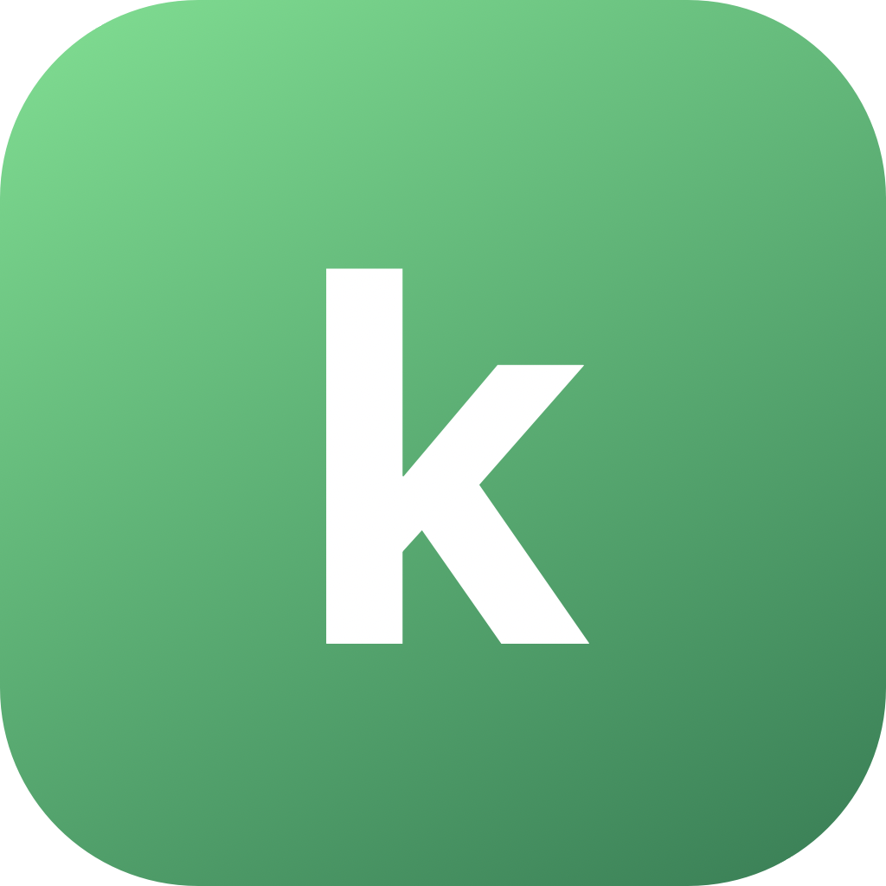

<p align="center">
  
</p>

<h1 align="center">kPad</h1>

<p align="center">
  <b>Turn any device into a trackpad, keyboard, and remote for your Mac</b><br>
  — over your local network, with <b>nothing to install on the phone</b>.
</p>

<p align="center">
  <i>by Kailaba</i><br>
  
  
  
</p>

---

Run one small menu-bar app on your Mac, open the shown URL (or scan the QR) in
your phone's browser, and your phone becomes a precise trackpad + keyboard +
media remote. No App Store, no account, no cloud — everything stays on your LAN.

## Why kPad

Most "phone as mouse" tools make you install an app on **both** the computer
**and** the phone, and many route your input through their servers. kPad is
deliberately smaller:

| | **kPad** | Typical alternatives |
|---|---|---|
| **Install on phone** | ❌ none — just a browser | ✅ app required (App Store / Play) |
| **Install on Mac** | ✅ one tiny menu-bar app | ✅ app required |
| **Cloud / account** | ❌ never — 100% local LAN | ⚠️ often cloud relay + sign-in |
| **Works offline** | ✅ even over a phone hotspot | ⚠️ frequently needs internet |
| **Cost / source** | ✅ free & open-source | ⚠️ freemium / closed |

- **Fully local.** No relay server, no account, no telemetry, no WebRTC. Your
  input never leaves your network. Works with **zero internet** — connect the
  Mac to your phone's hotspot and it still works.
- **Zero-install phone side.** Any phone or tablet with a modern browser: iOS
  Safari, Android Chrome. Nothing to update or trust on the device.
- **Connect in seconds.** Same Wi-Fi → scan the QR → you're driving the Mac.

## Features

- **Trackpad** — smooth pointer with tunable acceleration, tap to click,
  two-finger tap = right-click, two-finger scroll **with inertia**, and
  tap-and-a-half **drag-lock**. Multi-monitor aware.
- **Keyboard** — type with the phone's own keyboard, **voice dictation** via its
  mic, special keys (Esc/Tab/⌫/Return/arrows), and sticky **⌘⌃⌥⇧ combos**.
- **Clipboard sync**, both directions.
- **Media keys** — play/pause, prev/next, volume, mute, brightness.
- **Secure enough for a LAN** — a 6-digit pairing code (embedded in the QR);
  paired devices are remembered so they never re-prompt.

## Quick start

1. **Install the Mac app.** Grab the latest `kPad.dmg` from
   [Releases](../../releases), open it, and drag **kPad** onto **Applications**.
   Launch it — it lives in the menu bar. *(Or run from source — see
   [Development](#development).)*
2. **Grant Accessibility** once (the menu's "Grant Accessibility" item). macOS
   requires this to move the cursor and type.
3. **On your phone** (same Wi-Fi): open the menu's **Show QR code** and scan it,
   or type the shown URL. Enter the 6-digit code the first time — that's it.

> **First launch blocked?** The build is ad-hoc signed (free & open-source, not
> notarized), so macOS says *"Apple could not verify…"*. Open it via **System
> Settings → Privacy & Security →** scroll down **→ Open Anyway**, or run
> `xattr -dr com.apple.quarantine "/Applications/kPad.app"`. (Building locally
> with `make dmg` isn't quarantined, so it opens without this.)

**Always-on:** System Settings → General → Login Items → add **kPad**.

## No internet? Use a hotspot

No Wi-Fi anywhere? Turn on your phone's **personal hotspot**, connect the Mac to
it, and open the URL — the two devices share the hotspot LAN, so everything works
with no internet at all.

## Privacy & security

- LAN only. Input goes directly from your phone to your Mac over your local
  network — never to any third party.
- The only access control is the pairing code/token; that's intentional and
  appropriate for a same-network personal tool. Don't expose the port to the
  public internet.

## Development

Requires macOS 13+ and Python 3.12. The phone client is vanilla HTML/CSS/JS —
no build step.

```bash
make run     # dev server (run from a terminal that has Accessibility granted)
make app     # a dev kPad.app you can grant Accessibility to directly
make dmg     # build the self-contained, installable kPad.app + .dmg
make proto   # regenerate web/protocol.js from server/protocol.py
```

The Mac side is a single Python process: aiohttp serves the client and a
WebSocket on one port, input is synthesized via pyobjc/Quartz `CGEvent`, and the
menu bar is `rumps`. The wire protocol lives in one place — `server/protocol.py`
— and `make proto` regenerates the client's `web/protocol.js` mirror so the two
sides can never drift. Icons are generated by `scripts/gen_icon.py`.

> **Building requires a Mac.** PyInstaller doesn't cross-compile and the app uses
> macOS-only frameworks + `codesign`/`hdiutil`, so a `.dmg` cannot be built on
> Linux/Raspberry Pi — build locally on a Mac or on a macOS CI runner.

Releases are built and published automatically by GitHub Actions on a `macos`
runner when a `v*` tag is pushed (see `.github/workflows/release.yml`).

## Roadmap

- User-editable shortcut grid (JSON-defined).
- App-aware layouts: the Mac detects the frontmost app and the phone swaps its
  controls (Keynote → slide controls, video → scrub bar, …). The protocol
  already reserves a layout-hint message for this.

## License

MIT © Kailaba — see [LICENSE](LICENSE).
